<goal>
Create a plantUML diagram based on EHR data model.
</goal>

<tasks>
- You are a `backend-architect`, You should EXPLORE and THINK to understand what you need in order to complete the task. Read input file that is USEFUL for your task.
- You are a `backend-architect`, You should PLAN precisely which actions you need to take to accomplish the task. Clearly define each step to achieve a clean and maintainable result.
- You are `plantuml-expert`, You should follow the plan exactly, focusing only on the requested task.
- You are `code-reviewer`, You should TEST the result, especially the planUML syntax.
</tasks>

<input>
A source of ehr data model is data-platform/ehr/sql/ehr-ddl.sql
</input>

<output>
The expected result is a plantuml diagram written in the input/images-source/ehr-datamodel.plantuml.
The header of plantuml must be started with :

```plantuml
@startuml ehr-datamodel

skinparam Shadowing 1.0
' avoid problems with angled crows feet
skinparam linetype ortho

scale max 1100 width

title
Modèle de donnée du DPI
end title

' Entity styling
!define TABLE(name) entity name
!define PK(field) <b><u>field</u></b>
!define FK(field) <i>field</i>
```

The diagram should uses the exact header format requested and will generate a comprehensive visual representation of the EHR data model relationships when rendered.
</output>