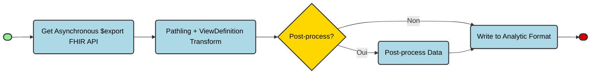

```mermaid
---
config:
  flowchart:
    curve: basis
---
flowchart LR
    Start([ ]) --> A(Get Asynchronous $export FHIR API)
    A --> B(Pathling + ViewDefinition Transform)
    B --> C{Post-process?}
    C -- Oui --> D(Post-process Data)
    C -- Non --> E(Write to Analytic Format)
    D --> E
    E --> End([ ])
    End
    
    Start:::startEnd
    A:::process
    B:::process
    C:::decision
    D:::process
    E:::process
    End:::startEnd
    classDef startEnd fill:#90EE90,stroke:#333,stroke-width:2px,color:#000
    classDef process fill:#ADD8E6,stroke:#333,stroke-width:2px,color:#000
    classDef decision fill:#FFD700,stroke:#333,stroke-width:2px,color:#000
    style End fill:#D50000
```