<subagent>
Use subagent plantuml-expert
Use subagent achitect-reviewer
Use subagent backend-architect
Use subagent code-reviewer
</subagent>
<goal>
Create a plantUML diagram on EHR data model.
</goal>
<input>
A source of ehr data model is input/sql/applications/ehr/questionnaire-core-ddl.sql
</input>
<expected-output>
The expected result is a plantuml file into input/images-source/ehr-datamodel.plantuml.
The header of plantuml must be started with :

```plantuml
@startuml ehr-datamodel

skinparam Shadowing 1.0
' avoid problems with angled crows feet
skinparam linetype ortho

scale max 1100 width

title
Modèle de donnée du DPI
end title
```

</expected-output>